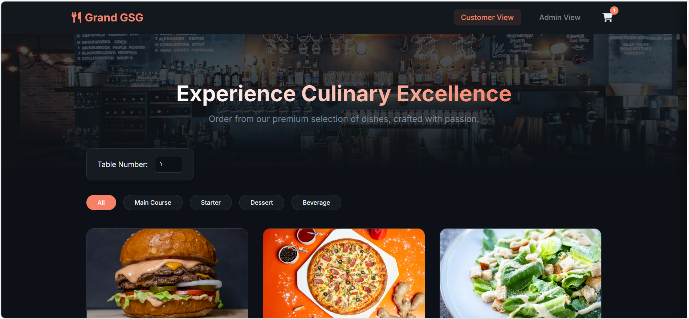

# Restaurant Management System (OOP Project)

This is an Object-Oriented Python project to manage a restaurant menu and customer orders with a web interface built with Flask.

## Features
- Add and manage menu items (name, price, category, images)
- Display the current menu via REST API
- Create and manage customer orders
- Track order status (pending, completed, cancelled)
- Web interface for restaurant staff and customers
- RESTful API endpoints for integration

## Requirements
- Python 3.7+
- Flask
- Flask-CORS

## How to Run

1. **Install dependencies:**
```bash
pip install -r requirements.txt
```

2. **Run the application:**
```bash
python main.py
```

3. **Access the web interface:**

## Screenshots



## Video Demo

📹 **[Watch the demo video](https://drive.google.com/file/d/1UkENxL5gTH2vsvlrI4bttdv4G9YyYJFT/view?usp=sharing)**

*Add a link to a demo video showing the application in action*

## Project Structure
```
├── main.py              # Flask application server
├── resturant.py         # Restaurant class (OOP)
├── menuitem.py          # MenuItem class
├── order.py             # Order and OrderItem classes
├── static/
│   ├── index.html       # Web interface
│   ├── app.js           # Frontend JavaScript
│   └── styles.css       # Styling
└── requirements.txt     # Python dependencies
```

## API Endpoints

- `GET /api/menu` - Get all menu items
- `POST /api/orders` - Create a new order
- `GET /api/orders` - Get all orders
- `PATCH /api/orders/<order_id>` - Update order status

## Author
Grand GSG Restaurant